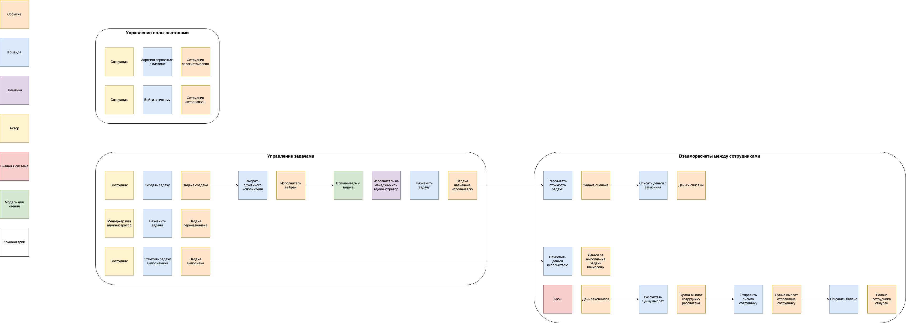
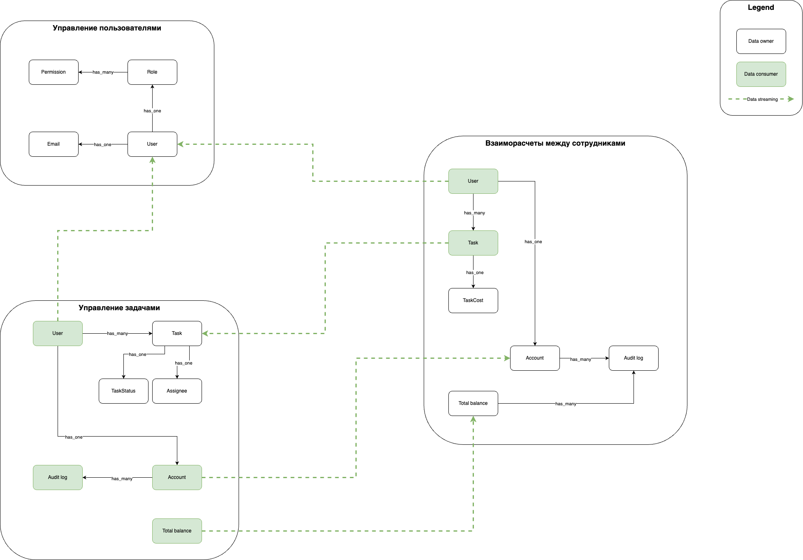

# Стратегический анализ компании UberPopug Inc

## Поддомены

| Поддомен                                 | Конкурентное преимущество | Сложность | Изменчивость | Вид        |
|------------------------------------------|---------------------------|-----------|--------------|------------|
| Повышение производительности сотрудников | Да                        | Да        | Нет          | Core       | 
| Взаиморасчеты между сотрудниками         | Нет                       | Да        | Нет          | Supporting |
| Ролевая модель и авторизация             | Нет                       | Да        | Нет          | Generic    |

### Повышение производительности сотрудников

Основная цель проекта, напрямую влияющая на конкурентное преимущество компании на рынке. 
Повышение производительности достигается с помощью развития компетенций попуг. 
Для этого им назначаются случайные задачи. Никаких гипотез проверять не планируют.  

### Взаиморасчеты между сотрудниками

Бухгалтерия с оплатой за выполнение задач между попугами.  

### Ролевая модель и авторизация

Типовая задача разделения прав пользователей по ролям. Решена кучей способов, можно было бы взять готовое решение или 
отдать на аутсорс. Но это не наш метод, у нас же форма клюва.

## Event storming

## Модель данных

## Вопросы

* Переназначение задач не запускает повторное списание с заказчика?
* Сотрудник с отрицательным балансом может заводить новые задачи?
* Возможно ли изменение списка ролей и прав?
